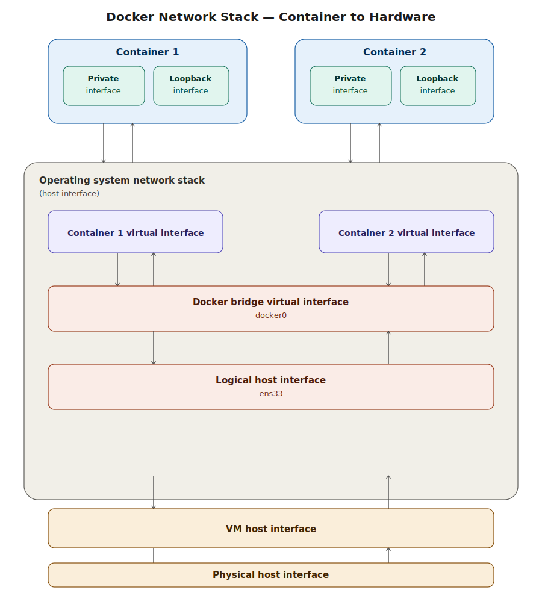

# Docker Networking — Architecture & Concepts

> How traffic actually flows from a container all the way to the physical network — and how Docker's bridge network connects containers to each other.

---

## Table of Contents

- [Docker Networking — Architecture \& Concepts](#docker-networking--architecture--concepts)
  - [Table of Contents](#table-of-contents)
  - [Why Networking Matters](#why-networking-matters)
  - [The Full Network Stack — From Container to Hardware](#the-full-network-stack--from-container-to-hardware)
    - [Layer by layer, bottom to top](#layer-by-layer-bottom-to-top)
    - [Tracing a request between two containers](#tracing-a-request-between-two-containers)
    - [Tracing a request from a container to the outside world](#tracing-a-request-from-a-container-to-the-outside-world)
  - [What Is a Bridge?](#what-is-a-bridge)
    - [How this applies to Docker](#how-this-applies-to-docker)
  - [The Three Default Docker Networks](#the-three-default-docker-networks)
    - [When to use each](#when-to-use-each)
  - [docker network — Command Overview](#docker-network--command-overview)
    - [connect / disconnect explained](#connect--disconnect-explained)
  - [Inspecting the Default Bridge Network](#inspecting-the-default-bridge-network)
    - [Checking the other default networks](#checking-the-other-default-networks)
  - [Running a Container and Watching It Join the Bridge](#running-a-container-and-watching-it-join-the-bridge)
  - [The Real-World Scenario for This Chapter](#the-real-world-scenario-for-this-chapter)

---

## Why Networking Matters

So far, we've worked with containers mostly in isolation — running one at a time, mapping a single port to our host. But real applications are rarely a single container. Our target scenario for this chapter is a full **ELK stack** (Elasticsearch, Logstash, Kibana) plus a monitoring stack (Prometheus, Grafana) plus Redis — multiple containers that all need to **talk to each other**.

This chapter covers the network architecture underneath every container, and the commands to control how containers connect.

---

## The Full Network Stack — From Container to Hardware

Before touching any commands, it's worth understanding the complete path that network traffic takes — from inside a container, all the way down to your physical network card. This reflects the exact setup used throughout this course: a CentOS VM (running Docker) hosted inside a hypervisor like VMware, running on a physical machine.



### Layer by layer, bottom to top

**1. Physical host interface**
This is the actual network card (NIC) on your physical machine — laptop, desktop, or server. It's the hardware that connects to the outside world, whether a local network or the internet.

**2. VM host interface**
If Docker is running inside a virtual machine (as in this course, where CentOS runs inside VMware), the hypervisor provides a virtual network adapter for the VM. This adapter bridges to the physical card based on how the VM's network mode is configured (bridged, NAT, host-only, etc.).

**3. Logical host interface (e.g. `ens33`)**
Inside the VM's operating system, this is the network interface that the OS itself sees — the Linux equivalent of your "network card" from the OS's point of view. You can see this with:

```bash
ifconfig
# or, on modern systems:
ip addr
```

In this course, the interface is named `ens33` — a standard naming convention for the first Ethernet interface on many Linux distributions.

**4. Docker bridge virtual interface (`docker0`)**
Once Docker is installed, it automatically creates a new virtual network interface on the host called `docker0`. This is **the bridge** — the central hub that all containers connect to by default. You'll see this appear in `ifconfig` output only after Docker is installed.

**5. Container virtual interface**
For every running container, Docker creates a corresponding virtual interface on the host side. This is the "other end of the cable" connecting the container to the `docker0` bridge.

**6. Container's private interface**
Inside the container itself, this is the interface the container's processes actually use to send and receive network traffic. It has its own private IP address (typically in the `172.17.x.x` range for the default bridge).

**7. Container's loopback interface**
Every container also has a loopback interface (`lo`, `127.0.0.1`) — used only for the container to talk to itself. Not relevant for external networking.

### Tracing a request between two containers

If **Container 1** wants to talk to **Container 2**, the path is:

```
Container 1 (private interface)
  → Container 1 virtual interface
    → docker0 bridge
      → Container 2 virtual interface
        → Container 2 (private interface)
```

The traffic never needs to leave the bridge — both containers are connected to the same `docker0` bridge, so Docker routes traffic between them directly at that layer.

### Tracing a request from a container to the outside world

If a container needs to reach something outside the host (e.g. the internet, or another physical machine), the path extends further down:

```
Container → virtual interface → docker0 bridge
  → logical host interface (ens33)
    → VM host interface
      → physical host interface
        → external network
```

If **any layer in this chain is disconnected** — for example, if a container is disconnected from the bridge — communication breaks at that point. This is exactly what `docker network disconnect` does, covered below.

---

## What Is a Bridge?

A **bridge**, in general networking terms, has nothing to do with Docker specifically — it's a fundamental networking concept.

Imagine two separate networks that have no way of seeing each other:

```
Network A          Network B
(isolated)          (isolated)
```

A bridge is a device or software component placed **between** them that allows traffic to pass from one to the other:

```
Network A  ──── Bridge ────  Network B
```

### How this applies to Docker

Every container has its own small, isolated virtual network. Without something connecting them, **Container 1** and **Container 2** would have no way of reaching each other.

Docker's `docker0` bridge solves this: it acts as the connector between every container's virtual network and every other container's virtual network (and to the host). When two containers are both connected to the same bridge, they can communicate.

This is exactly why, **by default**, every container you run gets automatically connected to the `docker0` bridge — so that out of the box, containers can talk to each other without any extra configuration.

---

## The Three Default Docker Networks

When Docker is installed, it automatically creates **three networks** for you:

| Network | Driver | Description |
|---|---|---|
| `bridge` | `bridge` | The default network. Any container that doesn't specify a network joins this one automatically. |
| `host` | `host` | The container shares the host's network stack directly — no isolation, no port mapping needed. |
| `none` | `null` | The container has **no network access** at all — fully isolated. |

### When to use each

**`bridge` (default):** General-purpose container networking. Containers get their own private IP, communicate through the bridge, and you control external access via port mapping (`-p`).

**`host`:** When you need maximum network performance and don't need isolation — the container directly uses the host's network interfaces. No port mapping is needed since the container *is* on the host's network. Common in monitoring agents and specific networking tools.

**`none`:** For containers that should have **zero network access** — for example, a script that processes local files only and should never make outbound connections, as a security measure.

> These three networks correspond to advanced concepts you'll meet later when working with orchestrators like Kubernetes — things like **ingress** networking build on these same fundamentals.

---

## docker network — Command Overview

```bash
docker network --help
```

Main subcommands:

| Subcommand | Description |
|---|---|
| `ls` | List all networks |
| `create` | Create a new network |
| `connect` | Connect a running container to a network |
| `disconnect` | Disconnect a container from a network |
| `inspect` | Show detailed information about a network |
| `prune` | Remove all unused networks |
| `rm` | Remove one or more specific networks |

### connect / disconnect explained

```bash
# Connect a running container to a network
docker network connect <network_name> <container_name>

# Disconnect a container from a network
docker network disconnect <network_name> <container_name>
```

**Why this matters:** If you disconnect a container from the bridge, it immediately loses the ability to communicate with any other container on that bridge — exactly as described in the architecture diagram above. This is also how you can isolate a specific container from the rest of your stack without stopping it.

---

## Inspecting the Default Bridge Network

```bash
docker network inspect bridge
```

This returns detailed JSON metadata:

```json
[
  {
    "Name": "bridge",
    "Id": "f7ab26d8f4d7...",
    "Driver": "bridge",
    "EnableIPv6": false,
    "IPAM": {
      "Config": [
        {
          "Subnet": "172.17.0.0/16",
          "Gateway": "172.17.0.1"
        }
      ]
    },
    "Containers": {},
    "Options": {},
    "Labels": {}
  }
]
```

Key fields:

| Field | Meaning |
|---|---|
| `Driver` | The network type — `bridge` in this case |
| `IPAM.Config.Subnet` | The IP range available for containers on this network |
| `IPAM.Config.Gateway` | The bridge's own IP — this is the `docker0` interface |
| `EnableIPv6` | Whether IPv6 is enabled (off by default) |
| `Containers` | Lists every container currently connected to this network, with its assigned IP |

### Checking the other default networks

```bash
docker network inspect host
docker network inspect none
```

Both will show `"Containers": {}` — until you explicitly run a container with `--network host` or `--network none`, nothing is attached to them. They exist by default, but stay empty unless used.

---

## Running a Container and Watching It Join the Bridge

By default — without specifying any `--network` flag — every container automatically joins the `bridge` network.

```bash
docker run -d \
  --name logstash \
  -p 5000:5000 \
  logstash:8.13.0
```

Confirm it's running:

```bash
docker ps
```

Now inspect the bridge network again:

```bash
docker network inspect bridge
```

This time, the `Containers` section is no longer empty:

```json
"Containers": {
  "7eab25...": {
    "Name": "logstash",
    "EndpointID": "a92f...",
    "MacAddress": "02:42:ac:11:00:02",
    "IPv4Address": "172.17.0.2/16",
    "IPv6Address": ""
  }
}
```

This confirms:
- The container `logstash` is connected to the `bridge` network
- It was automatically assigned the IP `172.17.0.2`
- This is the IP address other containers on the same bridge would use to reach this container directly (before we even talk about Docker's built-in DNS, covered in the next section of this chapter)

---

## The Real-World Scenario for This Chapter

Continuing from the project scenario introduced in the volumes chapter, we're building toward a full production-style observability stack — all connected on a shared Docker network:

| Component | Role |
|---|---|
| **Elasticsearch** | Stores and indexes logs |
| **Logstash** | Ingests and processes logs, forwards to Elasticsearch |
| **Kibana** | Web dashboard for visualizing logs |

The key challenges this chapter resolves:

- How do Logstash and Elasticsearch **find each other** on the network, given that container IPs change every time a container is recreated?
- How do we organize these services so they're isolated from unrelated containers, but fully connected to each other?
- How does this all tie together with the **volumes** we configured earlier, so that Elasticsearch's data and Logstash's config both persist?

The next part of this chapter covers Docker's built-in **DNS resolution** for containers on a custom network — which solves the "IPs keep changing" problem by letting containers reach each other **by container name** instead of by IP address.